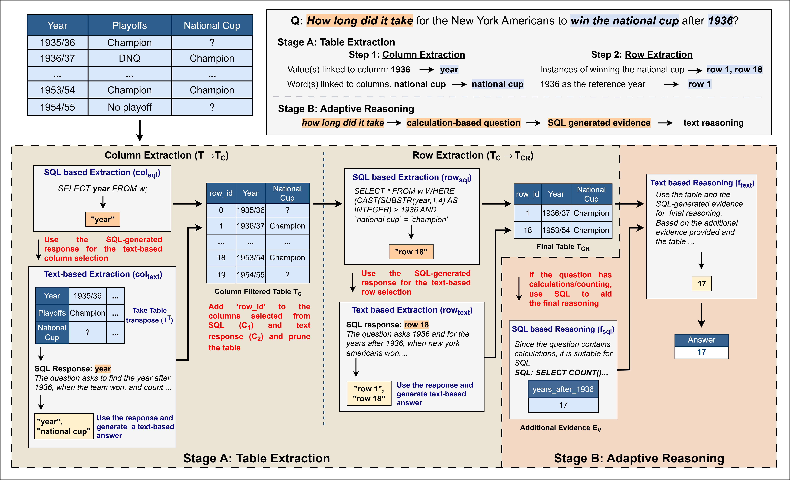

# H-STAR: LLM-driven Hybrid SQL-Text Adaptive Reasoning on Tables
---

Official Implementation of [H-STAR: LLM-driven Hybrid SQL-Text Adaptive Reasoning on Tables.](https://arxiv.org/abs/2407.05952)

## Overview
---

In this paper, we introduce a novel algorithm H-STAR that integrates both symbolic and semantic approaches to perform tabular reasoning tasks. H-STAR decomposes the table reasoning task into two stages: 1) Table Extraction and 2) Adaptive Reasoning. 



## Dependencies
---

Activate the environment by running

```
conda create -n hstar python=3.9
conda activate hstar
pip install -r requirements.txt
```
## Datasets
---

Benchmark datasets studied in the paper have been provided in the ```datasets/``` directory.

## Run
---

Run the H-STAR pipeline using

GPT: ``` run_gpt.py ```

Gemini: ``` run_gemini.py ```

Llama3: ``` run_llama3.py ```

## Evaluation
---
Evaluate the results for TabFact/ WikiTQ using the notebook
```
evaluate.ipynb
```

## Citation
---

If you find our paper or the repository helpful, please cite us with

```
@article{abhyankar2024h,
  title={H-STAR: LLM-driven Hybrid SQL-Text Adaptive Reasoning on Tables},
  author={Abhyankar, Nikhil and Gupta, Vivek and Roth, Dan and Reddy, Chandan K},
  journal={arXiv preprint arXiv:2407.05952},
  year={2024}
}
```

## Acknowledgement
---
This implementation is based on [Binding Language Models in Symbolic Languages](https://arxiv.org/abs/2210.02875). The work has also benefitted from [TabSQLify: Enhancing Reasoning Capabilities of LLMs Through Table Decomposition](https://arxiv.org/abs/2404.10150). Thanks to the author for releasing the code.

## Contact Us
---

For any questions or issues, you are welcome to open an issue in this repo, or contact us at [nikhilsa@vt.edu](nikhilsa@vt.edu),  [keviv9@gmail.com](keviv9@gmail.com).
